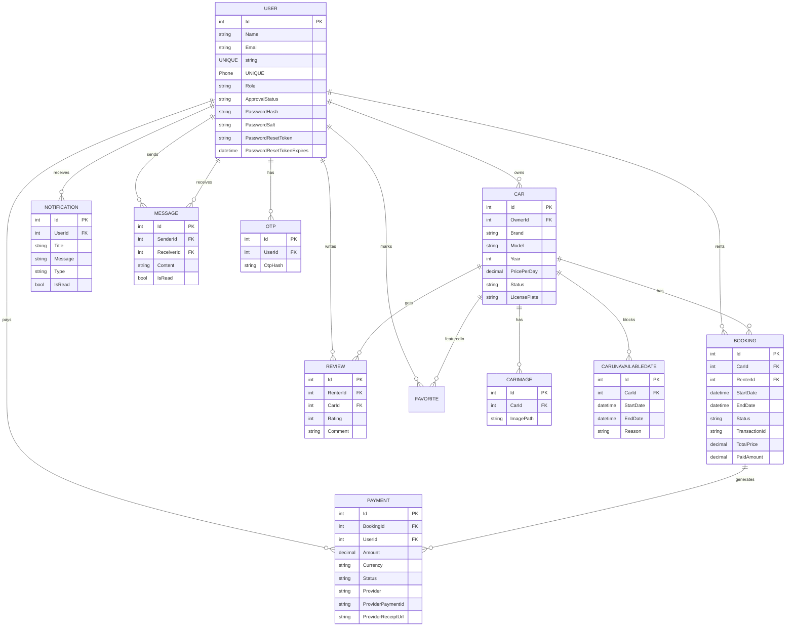
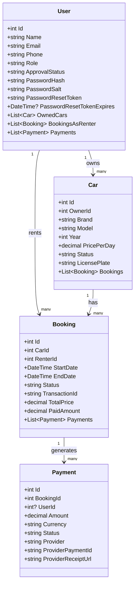
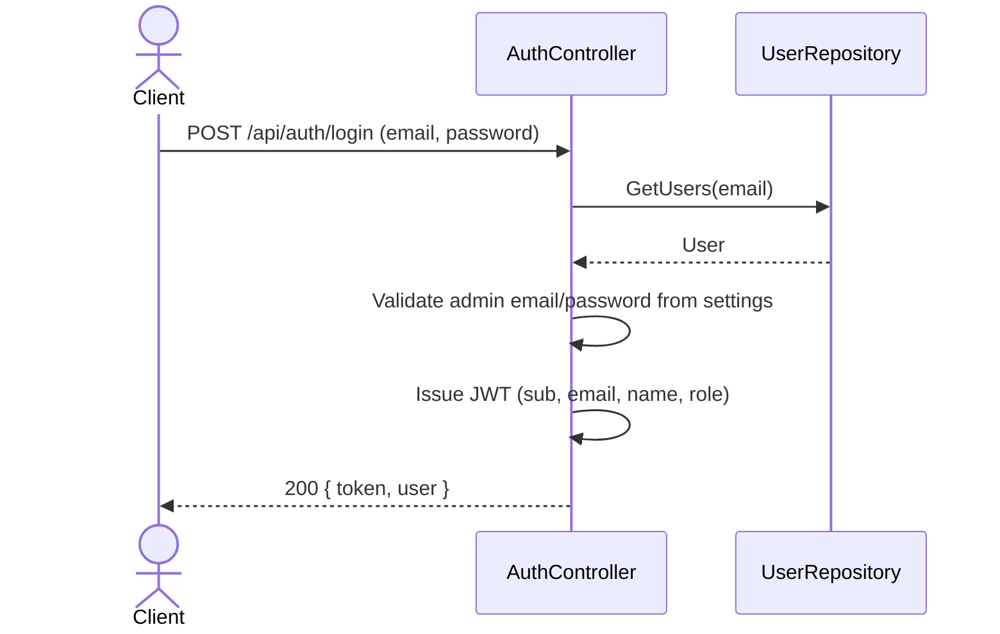
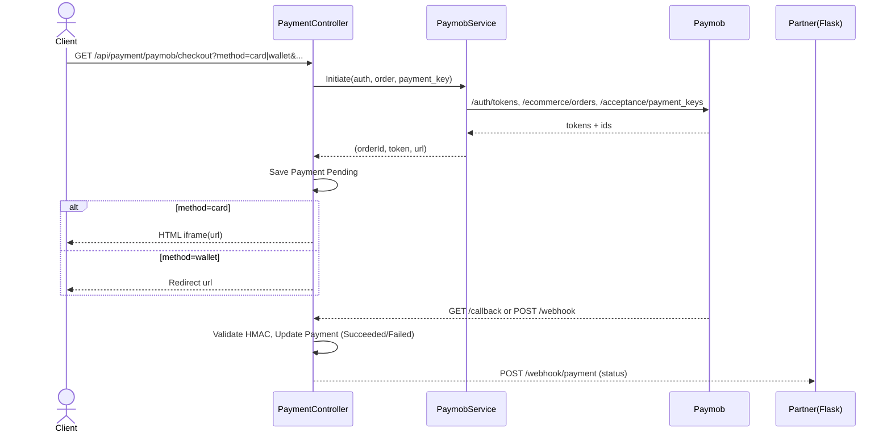
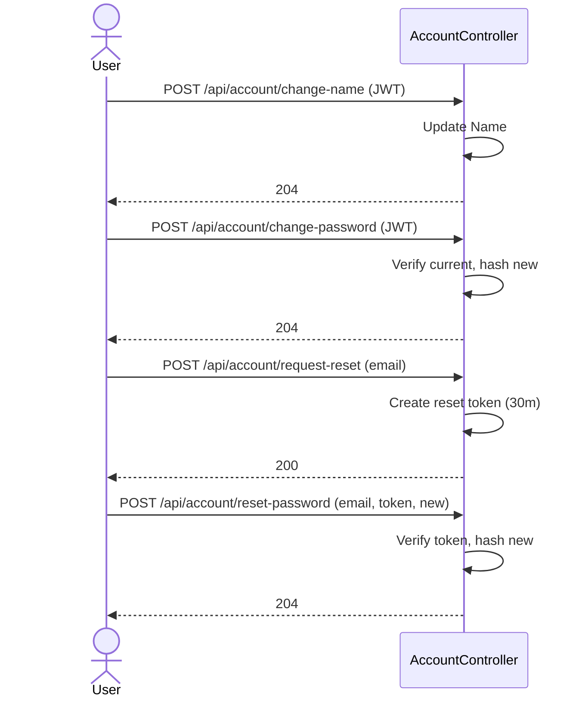

# Rently.Management Architecture

## Database ER Diagram

## Class Diagram (Core)

## Workflows

### Authentication (Login)

### Payments via Paymob (Card/Wallet)

### Account Management

## Key Files
- Program: [Program.cs](file:///c:/Users/Administrator/source/repos/Rently.Management/WebApi/Program.cs)
- Auth: [AuthController.cs](file:///c:/Users/Administrator/source/repos/Rently.Management/WebApi/Controllers/AuthController.cs)
- Payments: [PaymentController.cs](file:///c:/Users/Administrator/source/repos/Rently.Management/WebApi/Controllers/PaymentController.cs), [PaymobService.cs](file:///c:/Users/Administrator/source/repos/Rently.Management/WebApi/Services/PaymobService.cs)
- Account: [AccountController.cs](file:///c:/Users/Administrator/source/repos/Rently.Management/WebApi/Controllers/AccountController.cs), [PasswordService.cs](file:///c:/Users/Administrator/source/repos/Rently.Management/WebApi/Services/PasswordService.cs)
- Entities: [User.cs](file:///c:/Users/Administrator/source/repos/Rently.Management/Domain/Entities/User.cs), [Car.cs](file:///c:/Users/Administrator/source/repos/Rently.Management/Domain/Entities/Car.cs), [Booking.cs](file:///c:/Users/Administrator/source/repos/Rently.Management/Domain/Entities/Booking.cs), [Payment.cs](file:///c:/Users/Administrator/source/repos/Rently.Management/Domain/Entities/Payment.cs)
