# Rently.Management Architecture

## Database ER Diagram (Complete)
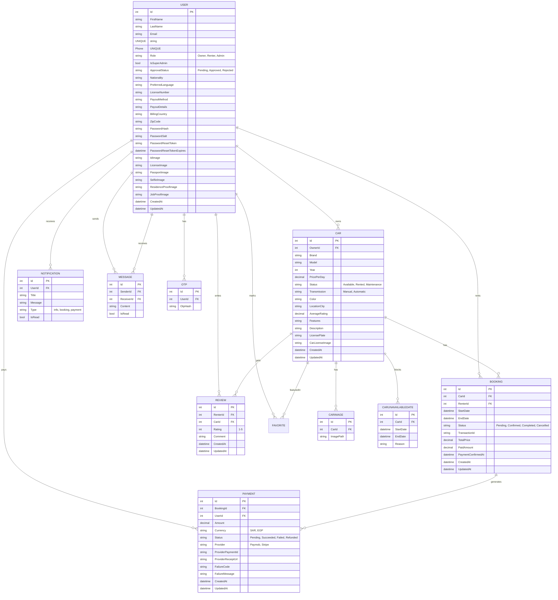
```mermaid
erDiagram
    USER ||--o{ CAR : owns
    USER ||--o{ BOOKING : rents
    USER ||--o{ PAYMENT : pays
    USER ||--o{ REVIEW : writes
    USER ||--o{ NOTIFICATION : receives
    USER ||--o{ FAVORITE : marks
    USER ||--o{ MESSAGE : sends
    USER ||--o{ MESSAGE : receives
    USER ||--o{ OTP : has

    CAR ||--o{ BOOKING : has
    CAR ||--o{ REVIEW : gets
    CAR ||--o{ CARIMAGE : has
    CAR ||--o{ CARUNAVAILABLEDATE : blocks
    CAR ||--o{ FAVORITE : featuredIn

    BOOKING ||--o{ PAYMENT : generates

    USER {
      int Id PK
      string FirstName
      string LastName
      string Email UNIQUE
      string Phone UNIQUE
      string Role "Owner, Renter, Admin"
      bool IsSuperAdmin
      string ApprovalStatus "Pending, Approved, Rejected"
      string Nationality
      string PreferredLanguage
      string LicenseNumber
      string PayoutMethod
      string PayoutDetails
      string BillingCountry
      string ZipCode
      string PasswordHash
      string PasswordSalt
      string PasswordResetToken
      datetime PasswordResetTokenExpires
      string IdImage
      string LicenseImage
      string PassportImage
      string SelfieImage
      string ResidenceProofImage
      string JobProofImage
      datetime CreatedAt
      datetime UpdatedAt
    }
    CAR {
      int Id PK
      int OwnerId FK
      string Brand
      string Model
      int Year
      decimal PricePerDay
      string Status "Available, Rented, Maintenance"
      string Transmission "Manual, Automatic"
      string Color
      string LocationCity
      decimal AverageRating
      string Features
      string Description
      string LicensePlate
      string CarLicenseImage
      datetime CreatedAt
      datetime UpdatedAt
    }
    BOOKING {
      int Id PK
      int CarId FK
      int RenterId FK
      datetime StartDate
      datetime EndDate
      string Status "Pending, Confirmed, Completed, Cancelled"
      string TransactionId
      decimal TotalPrice
      decimal PaidAmount
      datetime PaymentConfirmedAt
      datetime CreatedAt
      datetime UpdatedAt
    }
    PAYMENT {
      int Id PK
      int BookingId FK
      int UserId FK
      decimal Amount
      string Currency "SAR, EGP"
      string Status "Pending, Succeeded, Failed, Refunded"
      string Provider "Paymob, Stripe"
      string ProviderPaymentId
      string ProviderReceiptUrl
      string FailureCode
      string FailureMessage
      datetime CreatedAt
      datetime UpdatedAt
    }
    REVIEW {
      int Id PK
      int RenterId FK
      int CarId FK
      int Rating "1-5"
      string Comment
      datetime CreatedAt
      datetime UpdatedAt
    }
    NOTIFICATION {
      int Id PK
      int UserId FK
      string Title
      string Message
      string Type "info, booking, payment"
      bool IsRead
    }
    MESSAGE {
      int Id PK
      int SenderId FK
      int ReceiverId FK
      string Content
      bool IsRead
    }
    OTP {
      int Id PK
      int UserId FK
      string OtpHash
    }
    CARIMAGE {
      int Id PK
      int CarId FK
      string ImagePath
    }
    CARUNAVAILABLEDATE {
      int Id PK
      int CarId FK
      datetime StartDate
      datetime EndDate
      string Reason
    }
```

## Class Diagram (Detailed)
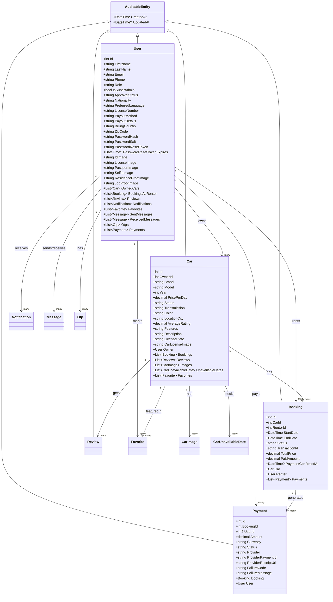
```mermaid
classDiagram
    class AuditableEntity {
      +DateTime CreatedAt
      +DateTime? UpdatedAt
    }
    class User {
      +int Id
      +string FirstName
      +string LastName
      +string Email
      +string Phone
      +string Role
      +bool IsSuperAdmin
      +string ApprovalStatus
      +string Nationality
      +string PreferredLanguage
      +string LicenseNumber
      +string PayoutMethod
      +string PayoutDetails
      +string BillingCountry
      +string ZipCode
      +string PasswordHash
      +string PasswordSalt
      +string PasswordResetToken
      +DateTime? PasswordResetTokenExpires
      +string IdImage
      +string LicenseImage
      +string PassportImage
      +string SelfieImage
      +string ResidenceProofImage
      +string JobProofImage
      +List~Car~ OwnedCars
      +List~Booking~ BookingsAsRenter
      +List~Review~ Reviews
      +List~Notification~ Notifications
      +List~Favorite~ Favorites
      +List~Message~ SentMessages
      +List~Message~ ReceivedMessages
      +List~Otp~ Otps
      +List~Payment~ Payments
    }
    class Car {
      +int Id
      +int OwnerId
      +string Brand
      +string Model
      +int Year
      +decimal PricePerDay
      +string Status
      +string Transmission
      +string Color
      +string LocationCity
      +decimal AverageRating
      +string Features
      +string Description
      +string LicensePlate
      +string CarLicenseImage
      +User Owner
      +List~Booking~ Bookings
      +List~Review~ Reviews
      +List~CarImage~ Images
      +List~CarUnavailableDate~ UnavailableDates
      +List~Favorite~ Favorites
    }
    class Booking {
      +int Id
      +int CarId
      +int RenterId
      +DateTime StartDate
      +DateTime EndDate
      +string Status
      +string TransactionId
      +decimal TotalPrice
      +decimal PaidAmount
      +DateTime? PaymentConfirmedAt
      +Car Car
      +User Renter
      +List~Payment~ Payments
    }
    class Payment {
      +int Id
      +int BookingId
      +int? UserId
      +decimal Amount
      +string Currency
      +string Status
      +string Provider
      +string ProviderPaymentId
      +string ProviderReceiptUrl
      +string FailureCode
      +string FailureMessage
      +Booking Booking
      +User User
    }
    
    AuditableEntity <|-- User
    AuditableEntity <|-- Car
    AuditableEntity <|-- Booking
    AuditableEntity <|-- Payment
    AuditableEntity <|-- Review
    
    User "1" --> "many" Car : owns
    User "1" --> "many" Booking : rents
    User "1" --> "many" Payment : pays
    User "1" --> "many" Notification : receives
    User "1" --> "many" Favorite : marks
    User "1" --> "many" Message : sends/receives
    User "1" --> "many" Otp : has
    
    Car "1" --> "many" Booking : has
    Car "1" --> "many" Review : gets
    Car "1" --> "many" CarImage : has
    Car "1" --> "many" CarUnavailableDate : blocks
    Car "1" --> "many" Favorite : featuredIn
    
    Booking "1" --> "many" Payment : generates
```

## Workflows (All Modules)

### 1. Authentication & Security
#### Login Workflow
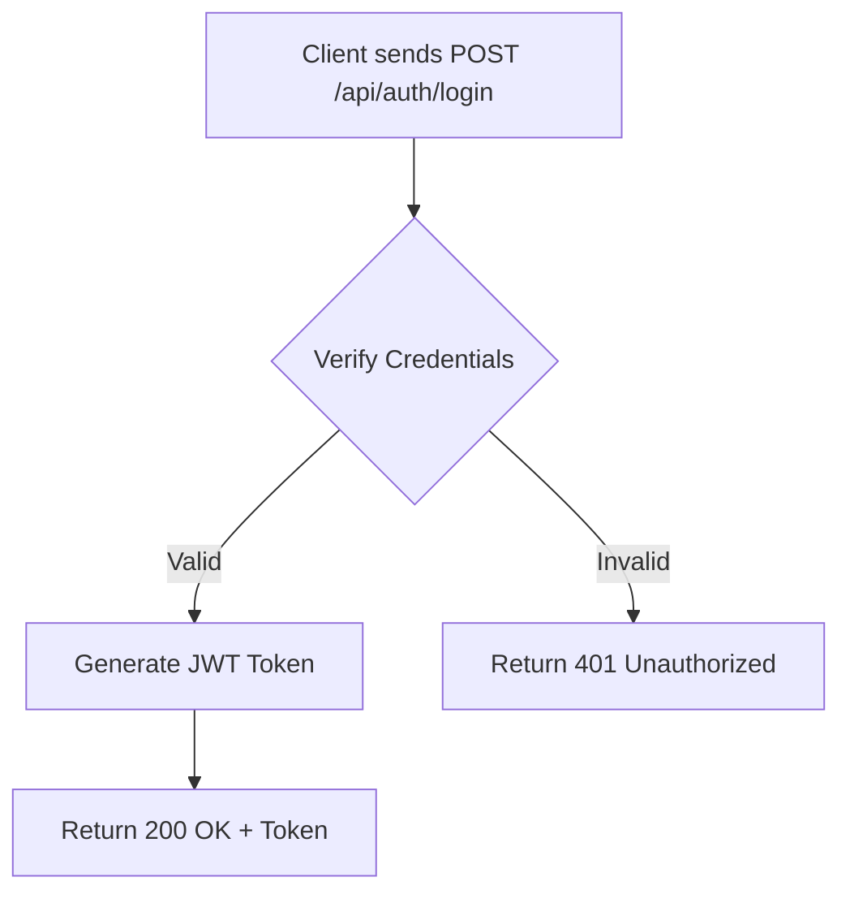
```mermaid
graph TD
    A[Client sends POST /api/auth/login] --> B{Verify Credentials}
    B -- Valid --> C[Generate JWT Token]
    B -- Invalid --> D[Return 401 Unauthorized]
    C --> E[Return 200 OK + Token]
```

#### Password Reset (OTP Flow)
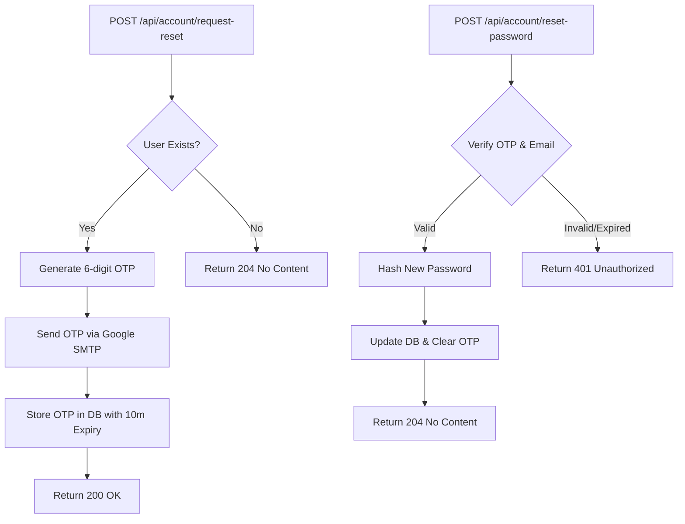
```mermaid
graph TD
    A[POST /api/account/request-reset] --> B{User Exists?}
    B -- Yes --> C[Generate 6-digit OTP]
    C --> D[Send OTP via Google SMTP]
    D --> E[Store OTP in DB with 10m Expiry]
    E --> F[Return 200 OK]
    B -- No --> G[Return 204 No Content]
    
    H[POST /api/account/reset-password] --> I{Verify OTP & Email}
    I -- Valid --> J[Hash New Password]
    J --> K[Update DB & Clear OTP]
    K --> L[Return 204 No Content]
    I -- Invalid/Expired --> M[Return 401 Unauthorized]
```

#### Add Admin (OTP Flow)
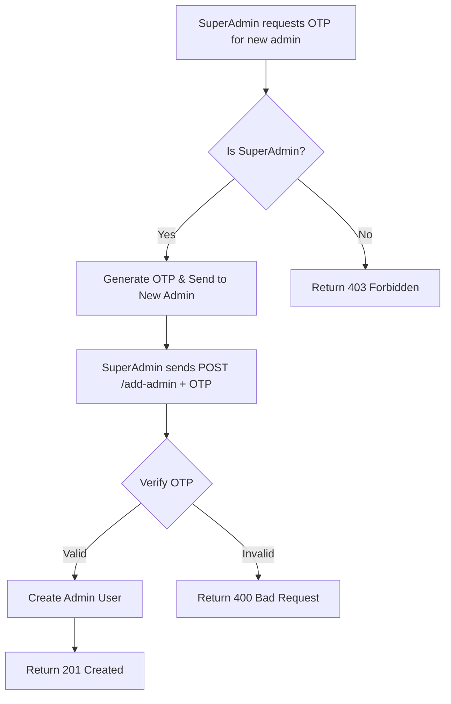
```mermaid
graph TD
    A[SuperAdmin requests OTP for new admin] --> B{Is SuperAdmin?}
    B -- Yes --> C[Generate OTP & Send to New Admin]
    C --> D[SuperAdmin sends POST /add-admin + OTP]
    D --> E{Verify OTP}
    E -- Valid --> F[Create Admin User]
    F --> G[Return 201 Created]
    E -- Invalid --> H[Return 400 Bad Request]
    B -- No --> I[Return 403 Forbidden]
```

### 2. User Onboarding & Verification
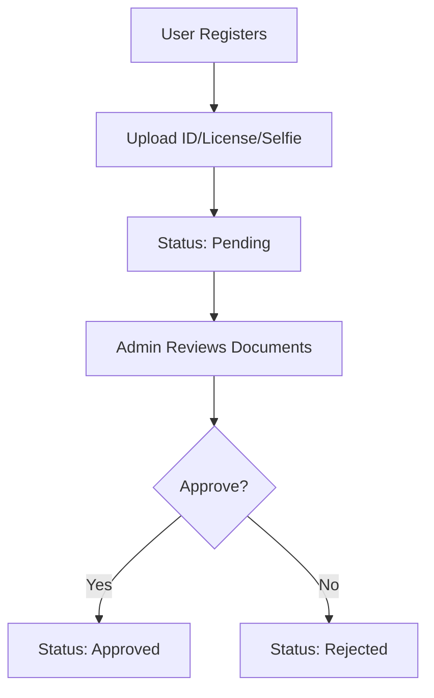
```mermaid
graph TD
    A[User Registers] --> B[Upload ID/License/Selfie]
    B --> C[Status: Pending]
    C --> D[Admin Reviews Documents]
    D --> E{Approve?}
    E -- Yes --> F[Status: Approved]
    E -- No --> G[Status: Rejected]
```

### 3. Car Management
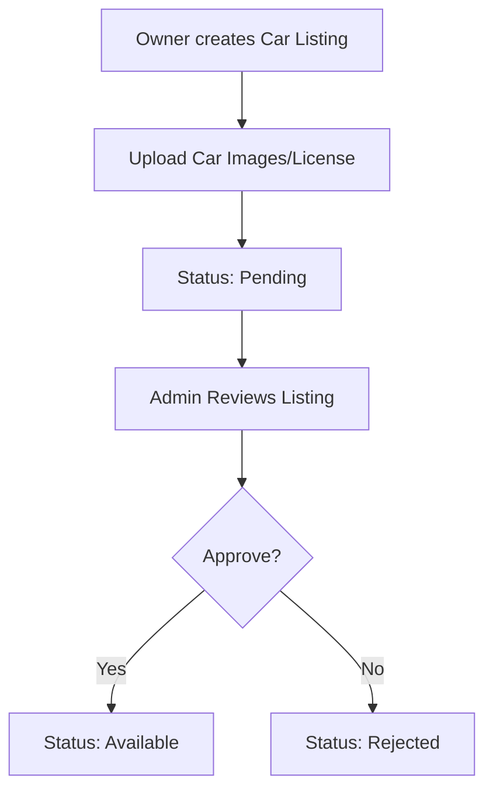
```mermaid
graph TD
    A[Owner creates Car Listing] --> B[Upload Car Images/License]
    B --> C[Status: Pending]
    C --> D[Admin Reviews Listing]
    D --> E{Approve?}
    E -- Yes --> F[Status: Available]
    E -- No --> G[Status: Rejected]
```

### 4. Booking Process
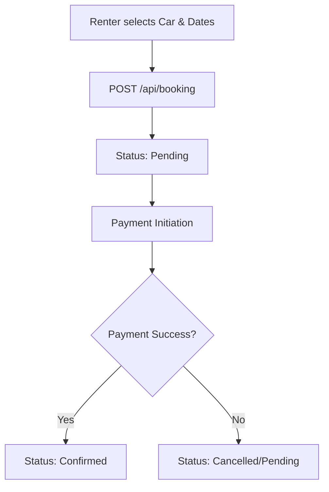
```mermaid
graph TD
    A[Renter selects Car & Dates] --> B[POST /api/booking]
    B --> C[Status: Pending]
    C --> D[Payment Initiation]
    D --> E{Payment Success?}
    E -- Yes --> F[Status: Confirmed]
    E -- No --> G[Status: Cancelled/Pending]
```

### 5. Payment Integration (Paymob)
```mermaid
graph TD
    A[POST /paymob/init] --> B[Auth with Paymob API]
    B --> C[Create Paymob Order]
    C --> D[Generate Payment Token]
    D --> E[Return Token + Iframe URL]
    E --> F[Client Completes Payment]
    F --> G[Paymob sends Webhook/Callback]
    G --> H{Verify HMAC Signature}
    H -- Valid --> I[Update Payment & Booking Status]
    I --> J[Notify Partner via Webhook]

### 6. Refund Process
```mermaid
graph TD
    A[Admin initiates Refund] --> B{Payment exists & Succeeded?}
    B -- Yes --> C[Create new Refund record]
    C --> D[Update original Payment to 'Refunding']
    D --> E[Notify Partner via Webhook]
    E -- F[Return 200 OK]
    B -- No --> G[Return 404/400 Error]
```

### 7. Partner Integration (Flask Webhooks)
The system notifies external services (e.g., a Flask app) about critical events using the `WebhookService`.
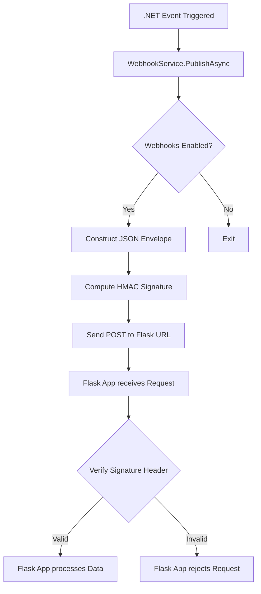
```mermaid
graph TD
    A[.NET Event Triggered] --> B[WebhookService.PublishAsync]
    B --> C{Webhooks Enabled?}
    C -- Yes --> D[Construct JSON Envelope]
    D --> E[Compute HMAC Signature]
    E --> F[Send POST to Flask URL]
    F --> G[Flask App receives Request]
    G --> H{Verify Signature Header}
    H -- Valid --> I[Flask App processes Data]
    H -- Invalid --> J[Flask App rejects Request]
    C -- No --> K[Exit]
```

### 8. Dashboard & Statistics
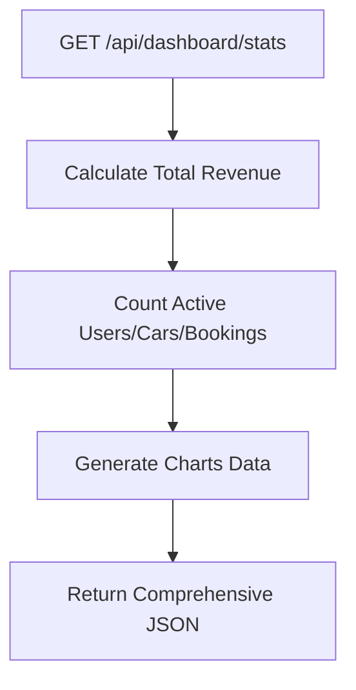
```mermaid
graph TD
    A[GET /api/dashboard/stats] --> B[Calculate Total Revenue]
    B --> C[Count Active Users/Cars/Bookings]
    C --> D[Generate Charts Data]
    D --> E[Return Comprehensive JSON]
```

### 9. Global Error Handling
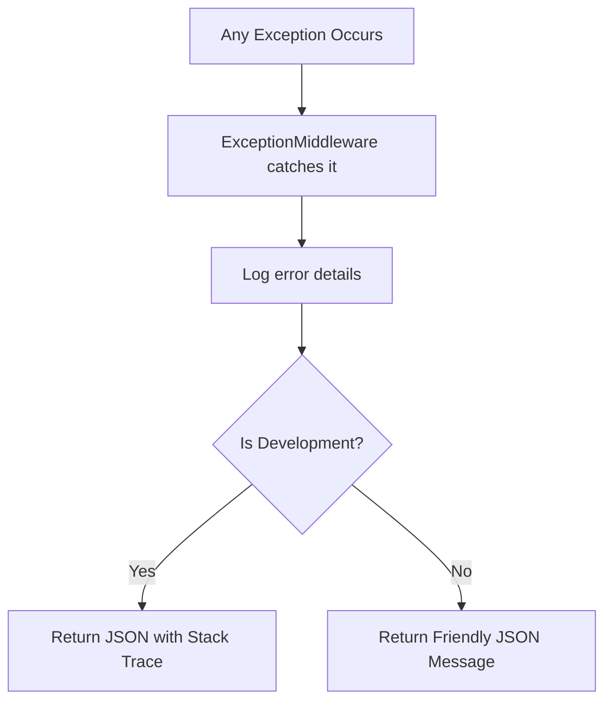
```mermaid
graph TD
    A[Any Exception Occurs] --> B[ExceptionMiddleware catches it]
    B --> C[Log error details]
    C --> D{Is Development?}
    D -- Yes --> E[Return JSON with Stack Trace]
    D -- No --> F[Return Friendly JSON Message]
```

## Key Files
- Program: [Program.cs](../WebApi/Program.cs)
- Auth: [AuthController.cs](../WebApi/Controllers/AuthController.cs)
- Payments: [PaymentController.cs](../WebApi/Controllers/PaymentController.cs), [PaymobService.cs](../WebApi/Services/PaymobService.cs)
- Account: [AccountController.cs](../WebApi/Controllers/AccountController.cs), [PasswordService.cs](../WebApi/Services/PasswordService.cs), [EmailService.cs](../WebApi/Services/EmailService.cs)
- Middleware: [ExceptionMiddleware.cs](../WebApi/Middleware/ExceptionMiddleware.cs)
- Entities: [User.cs](../Domain/Entities/User.cs), [Car.cs](../Domain/Entities/Car.cs), [Booking.cs](../Domain/Entities/Booking.cs), [Payment.cs](../Domain/Entities/Payment.cs)
