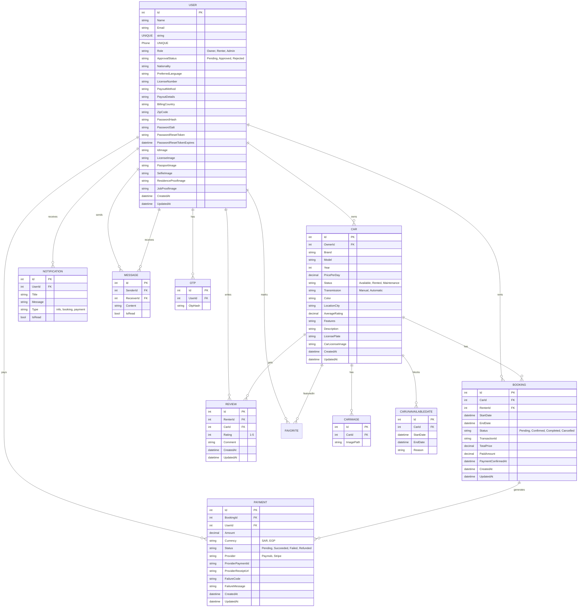
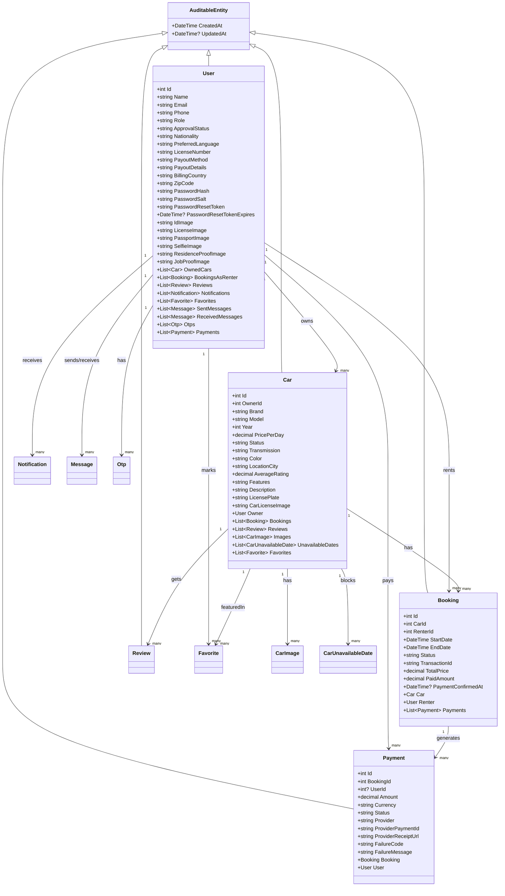

# Rently.Management Architecture

## Database ER Diagram (Complete)

```mermaid
erDiagram
    USER ||--o{ CAR : owns
    USER ||--o{ BOOKING : rents
    USER ||--o{ PAYMENT : pays
    USER ||--o{ REVIEW : writes
    USER ||--o{ NOTIFICATION : receives
    USER ||--o{ FAVORITE : marks
    USER ||--o{ MESSAGE : sends
    USER ||--o{ MESSAGE : receives
    USER ||--o{ OTP : has

    CAR ||--o{ BOOKING : has
    CAR ||--o{ REVIEW : gets
    CAR ||--o{ CARIMAGE : has
    CAR ||--o{ CARUNAVAILABLEDATE : blocks
    CAR ||--o{ FAVORITE : featuredIn

    BOOKING ||--o{ PAYMENT : generates

    USER {
      int Id PK
      string Name
      string Email UNIQUE
      string Phone UNIQUE
      string Role "Owner, Renter, Admin"
      string ApprovalStatus "Pending, Approved, Rejected"
      string Nationality
      string PreferredLanguage
      string LicenseNumber
      string PayoutMethod
      string PayoutDetails
      string BillingCountry
      string ZipCode
      string PasswordHash
      string PasswordSalt
      string PasswordResetToken
      datetime PasswordResetTokenExpires
      string IdImage
      string LicenseImage
      string PassportImage
      string SelfieImage
      string ResidenceProofImage
      string JobProofImage
      datetime CreatedAt
      datetime UpdatedAt
    }
    CAR {
      int Id PK
      int OwnerId FK
      string Brand
      string Model
      int Year
      decimal PricePerDay
      string Status "Available, Rented, Maintenance"
      string Transmission "Manual, Automatic"
      string Color
      string LocationCity
      decimal AverageRating
      string Features
      string Description
      string LicensePlate
      string CarLicenseImage
      datetime CreatedAt
      datetime UpdatedAt
    }
    BOOKING {
      int Id PK
      int CarId FK
      int RenterId FK
      datetime StartDate
      datetime EndDate
      string Status "Pending, Confirmed, Completed, Cancelled"
      string TransactionId
      decimal TotalPrice
      decimal PaidAmount
      datetime PaymentConfirmedAt
      datetime CreatedAt
      datetime UpdatedAt
    }
    PAYMENT {
      int Id PK
      int BookingId FK
      int UserId FK
      decimal Amount
      string Currency "SAR, EGP"
      string Status "Pending, Succeeded, Failed, Refunded"
      string Provider "Paymob, Stripe"
      string ProviderPaymentId
      string ProviderReceiptUrl
      string FailureCode
      string FailureMessage
      datetime CreatedAt
      datetime UpdatedAt
    }
    REVIEW {
      int Id PK
      int RenterId FK
      int CarId FK
      int Rating "1-5"
      string Comment
      datetime CreatedAt
      datetime UpdatedAt
    }
    NOTIFICATION {
      int Id PK
      int UserId FK
      string Title
      string Message
      string Type "info, booking, payment"
      bool IsRead
    }
    MESSAGE {
      int Id PK
      int SenderId FK
      int ReceiverId FK
      string Content
      bool IsRead
    }
    OTP {
      int Id PK
      int UserId FK
      string OtpHash
    }
    CARIMAGE {
      int Id PK
      int CarId FK
      string ImagePath
    }
    CARUNAVAILABLEDATE {
      int Id PK
      int CarId FK
      datetime StartDate
      datetime EndDate
      string Reason
    }
```

## Class Diagram (Detailed)

```mermaid
classDiagram
    class AuditableEntity {
      +DateTime CreatedAt
      +DateTime? UpdatedAt
    }
    class User {
      +int Id
      +string Name
      +string Email
      +string Phone
      +string Role
      +string ApprovalStatus
      +string Nationality
      +string PreferredLanguage
      +string LicenseNumber
      +string PayoutMethod
      +string PayoutDetails
      +string BillingCountry
      +string ZipCode
      +string PasswordHash
      +string PasswordSalt
      +string PasswordResetToken
      +DateTime? PasswordResetTokenExpires
      +string IdImage
      +string LicenseImage
      +string PassportImage
      +string SelfieImage
      +string ResidenceProofImage
      +string JobProofImage
      +List~Car~ OwnedCars
      +List~Booking~ BookingsAsRenter
      +List~Review~ Reviews
      +List~Notification~ Notifications
      +List~Favorite~ Favorites
      +List~Message~ SentMessages
      +List~Message~ ReceivedMessages
      +List~Otp~ Otps
      +List~Payment~ Payments
    }
    class Car {
      +int Id
      +int OwnerId
      +string Brand
      +string Model
      +int Year
      +decimal PricePerDay
      +string Status
      +string Transmission
      +string Color
      +string LocationCity
      +decimal AverageRating
      +string Features
      +string Description
      +string LicensePlate
      +string CarLicenseImage
      +User Owner
      +List~Booking~ Bookings
      +List~Review~ Reviews
      +List~CarImage~ Images
      +List~CarUnavailableDate~ UnavailableDates
      +List~Favorite~ Favorites
    }
    class Booking {
      +int Id
      +int CarId
      +int RenterId
      +DateTime StartDate
      +DateTime EndDate
      +string Status
      +string TransactionId
      +decimal TotalPrice
      +decimal PaidAmount
      +DateTime? PaymentConfirmedAt
      +Car Car
      +User Renter
      +List~Payment~ Payments
    }
    class Payment {
      +int Id
      +int BookingId
      +int? UserId
      +decimal Amount
      +string Currency
      +string Status
      +string Provider
      +string ProviderPaymentId
      +string ProviderReceiptUrl
      +string FailureCode
      +string FailureMessage
      +Booking Booking
      +User User
    }
    
    AuditableEntity <|-- User
    AuditableEntity <|-- Car
    AuditableEntity <|-- Booking
    AuditableEntity <|-- Payment
    AuditableEntity <|-- Review
    
    User "1" --> "many" Car : owns
    User "1" --> "many" Booking : rents
    User "1" --> "many" Payment : pays
    User "1" --> "many" Notification : receives
    User "1" --> "many" Favorite : marks
    User "1" --> "many" Message : sends/receives
    User "1" --> "many" Otp : has
    
    Car "1" --> "many" Booking : has
    Car "1" --> "many" Review : gets
    Car "1" --> "many" CarImage : has
    Car "1" --> "many" CarUnavailableDate : blocks
    Car "1" --> "many" Favorite : featuredIn
    
    Booking "1" --> "many" Payment : generates
```

## Workflows (All Modules)

### 1. Authentication & Security
#### Login Workflow
1. Client sends `POST /api/auth/login` (email, password).
2. API validates admin email/password from configuration or verifies stored PBKDF2 hash for DB users.
3. If valid, API issues a JWT (containing `sub`, `email`, `name`, `role`).
4. Client uses this token in the `Authorization: Bearer <token>` header for subsequent requests.

#### Password Reset (OTP Flow)
1. User sends `POST /api/account/request-reset` (email).
2. API generates a 6-digit OTP, stores it in `PasswordResetToken` (expires in 10m).
3. API sends OTP via `EmailService`.
4. User sends `POST /api/account/reset-password` (email, otp, newPassword).
5. API verifies OTP, hashes the new password, and clears reset fields.

#### Add Admin (OTP Flow)
1. SuperAdmin sends `POST /api/account/request-admin-otp` (newAdminEmail).
2. API generates OTP (10m) and sends it to the new admin's email.
3. SuperAdmin sends `POST /api/account/add-admin` (details, otp).
4. API verifies OTP and SuperAdmin's identity, then creates the new admin.

### 2. User Onboarding & Verification
1. User registers as Owner or Renter.
2. User uploads verification documents (ID Image, License Image, Selfie, etc.) via `UserController`.
3. Admin reviews user details and documents in `RequestController`.
4. Admin approves or rejects via `PATCH /api/request/{id}/status`.
5. User's `ApprovalStatus` is updated, enabling them to list cars or book trips.

### 3. Car Management
#### Car Listing
1. Owner sends `POST /api/car` (car details, ownerId).
2. API verifies Owner's approval status.
3. Car is created with `Status: Pending`.
4. Owner uploads car images and license documents.
5. Admin reviews car listing in `RequestController` and approves it.
6. Car status becomes `Available`.

#### Availability Management
- Owner can set unavailable dates via `CarUnavailableDate`.
- These dates prevent renters from booking the car during those periods.

### 4. Booking Process
1. Renter searches for cars using `GET /api/car` with filters (location, dates, price).
2. Renter selects a car and sends `POST /api/booking` (carId, dates).
3. Booking is created with `Status: Pending`.
4. (Optional) Owner reviews and approves the booking.
5. Booking status becomes `Confirmed` once payment is initialized/completed.

### 5. Payment Integration (Paymob)
#### Payment Initiation
1. Client calls `POST /api/payment/paymob/init` (bookingId, amount, method).
2. API verifies `BookingId` and `UserId`.
3. `PaymobService` authenticates with Paymob API and creates an Order.
4. API returns a `payment_token` and `url`.
5. Client opens the Paymob Iframe (Card) or redirects to Paymob (Wallet).

#### Callback & Webhook Handling
1. Paymob redirects to `GET /api/payment/paymob/callback` or sends `POST /api/payment/paymob/webhook`.
2. API validates HMAC signature for security.
3. If successful, API updates `Payment` status to `Succeeded` and updates `Booking` status.
4. `WebhookService` notifies external partners (e.g., Flask listener).

### 6. Post-Booking Interaction
#### Reviews & Ratings
- Renter can post a review after trip completion via `POST /api/review`.
- Car's `AverageRating` is recalculated.

#### Messaging
- Owners and Renters can communicate via `POST /api/message`.

#### Notifications
- System sends notifications for booking status updates, payment confirmations, etc.

### 7. Global Error Handling
1. `ExceptionMiddleware` intercepts all unhandled exceptions.
2. It logs the error and returns a structured JSON response.
3. In Development, it includes the stack trace; in Production, it returns a generic message.
4. This ensures a consistent 500 error format for the frontend.

## Key Files
- Program: [Program.cs](file:///c:/Users/Administrator/source/repos/Rently.Management/WebApi/Program.cs)
- Auth: [AuthController.cs](file:///c:/Users/Administrator/source/repos/Rently.Management/WebApi/Controllers/AuthController.cs)
- Payments: [PaymentController.cs](file:///c:/Users/Administrator/source/repos/Rently.Management/WebApi/Controllers/PaymentController.cs), [PaymobService.cs](file:///c:/Users/Administrator/source/repos/Rently.Management/WebApi/Services/PaymobService.cs)
- Account: [AccountController.cs](file:///c:/Users/Administrator/source/repos/Rently.Management/WebApi/Controllers/AccountController.cs), [PasswordService.cs](file:///c:/Users/Administrator/source/repos/Rently.Management/WebApi/Services/PasswordService.cs), [EmailService.cs](file:///c:/Users/Administrator/source/repos/Rently.Management/WebApi/Services/EmailService.cs)
- Middleware: [ExceptionMiddleware.cs](file:///c:/Users/Administrator/source/repos/Rently.Management/WebApi/Middleware/ExceptionMiddleware.cs)
- Entities: [User.cs](file:///c:/Users/Administrator/source/repos/Rently.Management/Domain/Entities/User.cs), [Car.cs](file:///c:/Users/Administrator/source/repos/Rently.Management/Domain/Entities/Car.cs), [Booking.cs](file:///c:/Users/Administrator/source/repos/Rently.Management/Domain/Entities/Booking.cs), [Payment.cs](file:///c:/Users/Administrator/source/repos/Rently.Management/Domain/Entities/Payment.cs)
