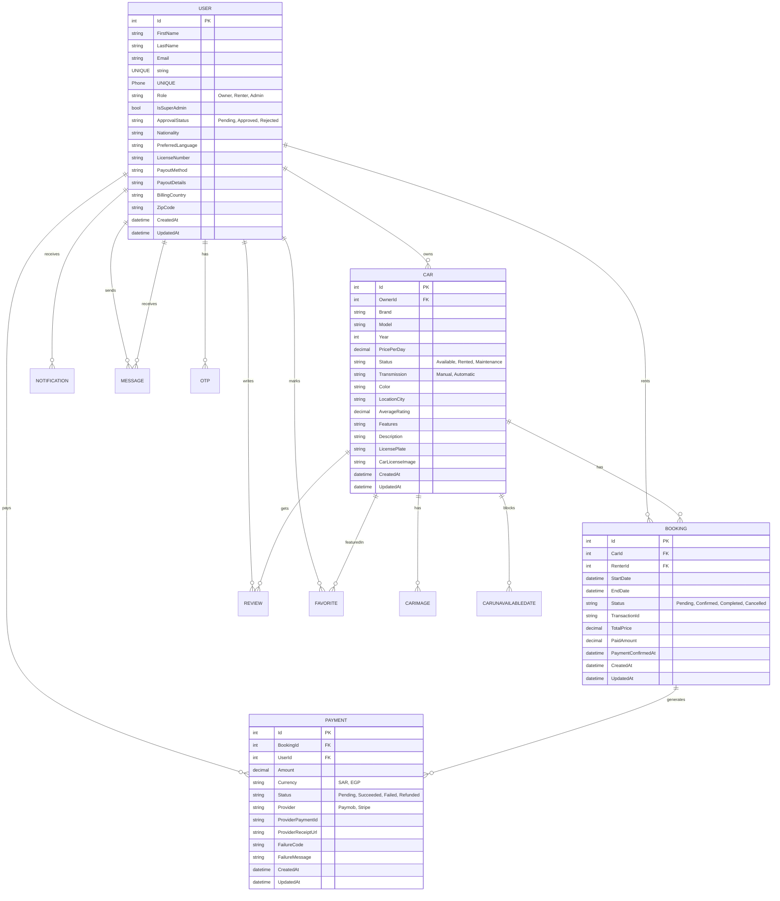
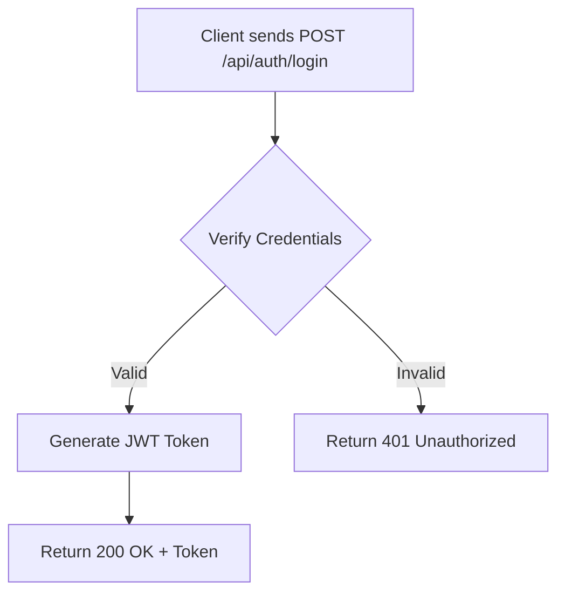
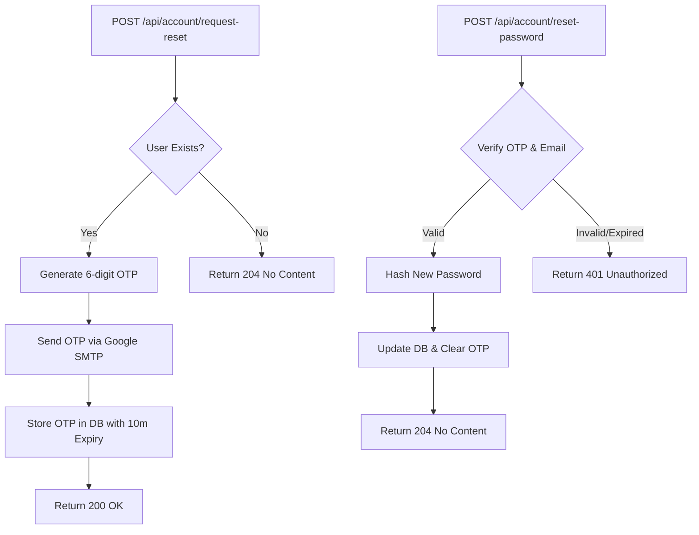
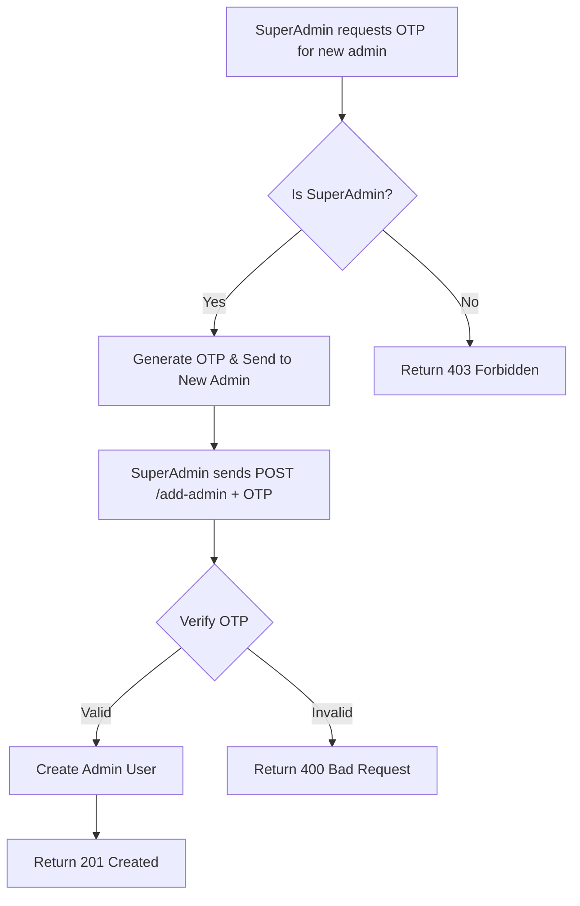
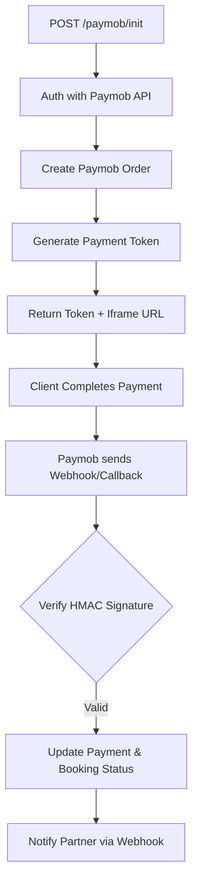
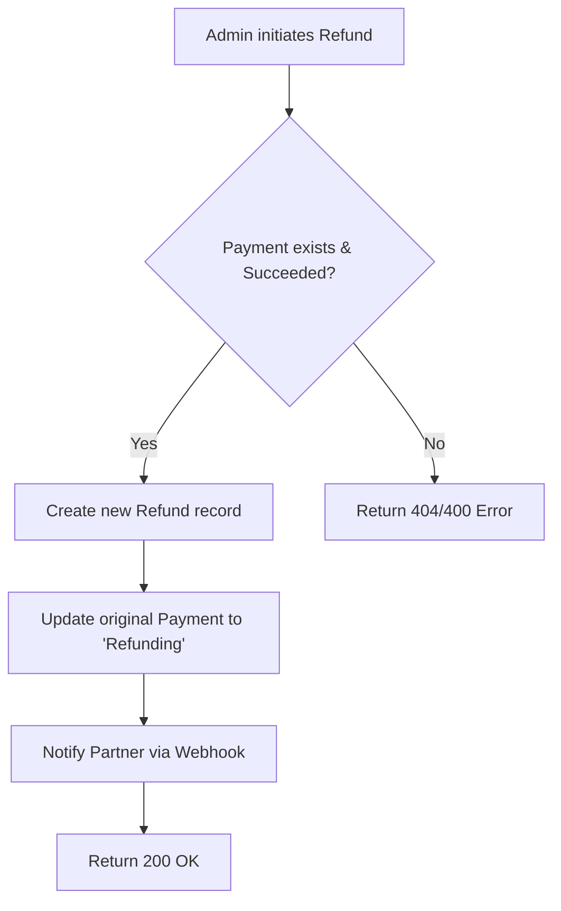
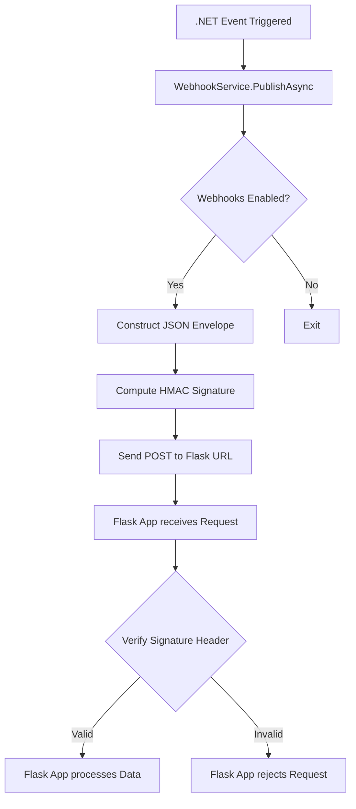

# Graduation Project Report: Rently Management System

## 1. Introduction
The **Rently Management System** is the core backend engine responsible for the operations of an integrated car rental platform. The system aims to provide a secure, stable, and scalable environment for managing users, vehicles, bookings, and payments. It serves as the central hub connecting the mobile application (Flutter), partner systems (Flask), and electronic payment gateways.

### Technology Choice Rationale
Modern Microsoft technologies were chosen to build this system based on several strategic factors:
- **.NET 9**: The latest version of the .NET ecosystem, providing high performance and full support for distributed systems.
- **C#**: A powerful, strongly-typed language that supports object-oriented programming and modern patterns, reducing runtime errors.
- **Entity Framework Core**: A professional ORM tool that allows database interaction through code objects, facilitating maintenance and a "Code-First" development approach.
- **SQL Server**: A robust relational database ensuring data integrity and the capability to handle large volumes of transactions.

---

## 2. Architecture & Design Patterns

### Clean Architecture
The project follows the Clean Architecture pattern to ensure a strict separation of concerns:
1. **Domain Layer**: Contains core entities, business logic, and repository interfaces.
2. **Infrastructure Layer**: Handles technical details such as database access and repository implementations.
3. **WebApi Layer**: The interface for external communication, containing Controllers and DTOs (Data Transfer Objects).

### Design Patterns
- **Repository Pattern**: Used to decouple data access logic from the business logic in Controllers.
- **Dependency Injection (DI)**: Manages object lifecycles and reduces direct dependencies between components, enhancing testability.
- **Middleware Pattern**: Handles cross-cutting concerns, such as Global Error Handling and Authentication.

#### Controller-Service Communication
The Controller acts as an orchestrator; it receives an HTTP request, validates it using DTOs, and then invokes the appropriate Repository or Service to execute the business logic. Finally, it returns a standard HTTP response to the client.

---

## 3. Database & Data Management

### Entity-Relationship Diagram (ERD)
The database is designed to be fully relational (Normalized) to ensure data consistency:

---

## 4. System Workflows (Logic Flow)

This section details the critical operational flows within the Rently Management system.

### 4.1. Authentication & Security Workflow

### 4.2. Password Reset (OTP Flow)

### 4.3. Super Admin & Admin Creation Flow

### 4.4. Booking & Payment Integration (Paymob)

### 4.5. Refund Process Workflow

### 4.6. Partner Integration (Flask Webhooks)

---

## 5. RESTful APIs & Integration

The system is built with an **API-First** philosophy, enabling multiple platforms to consume the same data.

### Endpoint Structure
Routes follow standard REST principles:
- `GET /api/resource`: Fetch data.
- `POST /api/resource`: Create a new record.
- `PUT /api/resource/{id}`: Full update.
- `PATCH /api/resource/{id}`: Partial update (e.g., account status).
- `DELETE /api/resource/{id}`: Soft or hard deletion.

### Flask Integration (Partner Webhooks)
The system utilizes **Webhooks** to communicate with the Flask partner application. When a specific event occurs (e.g., a successful payment), the backend sends a JSON payload to the Flask URL with an **HMAC Signature** to ensure the data is authentic and originates from a trusted source.

### Frontend Integration
Communication is handled via HTTP requests, with a **JWT (JSON Web Token)** passed in the header for authorized requests. Data is exchanged exclusively in JSON format using **Snake Case** naming conventions to match mobile app standards.

---

## 5. Security & Authentication
A multi-layered security system has been implemented to protect user data and financial transactions:

### 1. JWT Authentication
The system uses **JSON Web Tokens**. Upon login, an encrypted token is generated containing user identification and claims (roles). This token has a specific expiration time and is verified programmatically for every request.

### 2. Super Admin Protection
A dedicated `IsSuperAdmin` field exists in the database. This field is protected and cannot be modified via any public API. It is set manually or through secure system configurations. Only a Super Admin has the authority to add new administrative accounts.

### 3. Password Hashing
Passwords are never stored as plain text. We utilize industry-standard hashing algorithms with a unique **Salt** for each user to prevent Rainbow Table attacks.

### 4. HMAC Verification
For payment gateway (Paymob) and Flask integrations, we use **HMAC (Hash-based Message Authentication Code)** to ensure data has not been tampered with during transit.

---
**Prepared by:** [Your Name Here]
**Supervised by:** [Supervisor's Name Here]
**Academic Year:** 2025/2026
